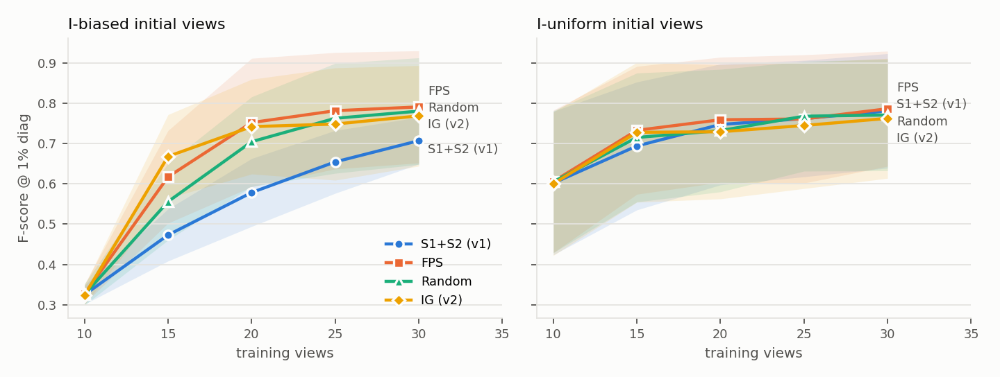

# multiview-recon-eval

**面向家具数字孪生的 3DGS 重建质量评估与补扫视角选择**

机器人或机械臂扫描家具时，首轮采集常常存在盲区：有些角度够不到，有些面被挡住。本项目研究：**能否只根据重建结果本身（不看真值）判断"哪里还没重建好"，并据此选择补扫视角，让几何完整性比随机补拍或均匀补拍提升得更快。**

> 状态：合成数据上的主实验（M0–M3）已经完成。真实家具部分（M4）的处理流程已在模拟采集数据上验证通过，还在等待真实照片。所有数字都来自 `results/` 下的原始结果，没有预估值。

## TL;DR



*3 件家具 × 2 个随机种子，阴影带为对象与种子之间的标准差。IG (v2) 是在 v1 失败之后设计的，只用椅子开发，结论以留出对象为准（见下文）。*

| 结论 | 数据 |
|---|---|
| **偏置初始视角下，首次补扫（+5 张）选得好不好差别很大** | 留出对象上的 F@1%：**IG (v2) 0.683**、FPS 0.647、Random 0.583、S1+S2 (v1) 0.463 |
| **预先设计的 v1 信号失败了，失败原因已查明** | v1 在偏置配置下，全部 4 轮的平均 F@1% 为 0.603，FPS 为 0.736；原因见 §4.2 |
| **v2 只在首次补扫时领先，之后 FPS 追平** | 留出对象上 IG − FPS 的配对差：偏置配置 +0.036（4 组中 3 组更好），均匀配置 +0.035（4/4）；全部轮次平均：0.766 vs 0.776，0.809 vs 0.805 |
| **渲染质量好 ≠ 几何准确** | 用全部 200 个视角训练：PSNR **41.1**，但 F@1% 只有 **0.81**；32% 的像素深度误差超过对角线的 1% |
| **信号计算开销很小** | 选一次视角约 0.5 s，一次 3DGS 训练约 40 s（RTX 4090 D） |
| **真实数据流程（模拟验证）** | 90/90 张图注册，ArUco 对齐 RMS 1.15 mm；尺寸误差：宽 +4.8 mm，进深 +1.5 mm，高 −27 mm |

核心重建组件（COLMAP、gsplat、Open3D、Blender）都来自开源项目。本项目的工作包括：质量信号与补扫策略、评测协议（含可观测真值和评测管线自检）、精简训练器、真实数据的尺度恢复与自动测量流程，以及全部对比实验和分析。

## 1. 研究问题

| # | 问题 | 结论（§4） |
|---|---|---|
| Q1 | 无真值的质量信号能否预测某个视角的真实误差？ | 部分可以：与该视角 PSNR 的 Spearman ρ 在 −0.35 到 −0.53 之间；与深度坏像素率几乎不相关（原因见 §4.4） |
| Q2 | 按信号选补扫视角，几何完整性是否比基线提升更快？ | v1 不行；v2 仅在首次补扫时领先 |
| Q3 | 渲染指标和几何指标的结论是否一致？ | 不一致，见上表 |
| Q4 | 整条流程能否在真实家具上跑通？尺寸精度如何？ | 模拟采集已验证；真实照片待采集 |

## 2. 流程

```
            ┌──────────── 合成数据（主实验）────────────┐
ABO 家具模型 ─► Blender Cycles 渲染（RGBA，200 个候选视角 + 60 个测试视角）
                              │
                   初始 10 张（I-均匀 / I-偏置）
                              │
        ┌─────────────────────┴───────────────────────┐
        ▼                                             │
  3DGS 从头训练（gsplat，7k 步）                       │
        ├─► 测试视角：PSNR / SSIM / LPIPS              │
        ├─► 渲染深度 → Open3D TSDF → F-score（可观测真值）│
        └─► 给剩余候选视角打分 → 选 5 张 ──────────────┘  × 4 轮

            ┌──────────── 真实数据 ────────────┐
手机照片 + 地面上的 A4 ArUco 标定板 ─► COLMAP ─► ArUco 三角化 + Umeyama 相似变换（米制，地面 z=0）
 ─► gsplat ─► TSDF 网格 ─► RANSAC 精修地面 ─► 聚类 ─► 高 / 宽 / 进深
```

## 3. 方法

### 3.1 v1 信号（实验前预先设计，权重事先固定）

| 信号 | 定义 |
|---|---|
| **S1 包络空洞** | 用训练视角的 mask 做空间雕刻得到 visual hull，把它投影到候选视角，统计其中渲染 α < 0.5 的像素比例 |
| **S2 低观测支持** | 对每个训练视角求 ∂(Σα)/∂opacity，统计每个高斯在多少个视角中真正参与了成像（被遮挡的高斯梯度为 0）。候选视角的得分是其像素上 1/(1+c) 按 α 加权的平均值 |
| 组合 | S1 和 S2 在候选池内各自做 z-score 后等权相加；按得分贪心选取，并做 15° 角度非极大值抑制 |

### 3.2 v2 信号：体素信息增益（在 v1 失败后设计）

- 对 visual hull 内部的体素，只要有某个训练视角能看到它，并且它**不在该视角渲染出的表面之后**，就标为"已知"。其余的标为"未知"。
- 候选视角的增益 = 它的视线在碰到当前重建表面**之前**能看到的未知体素数。
- 选择方式为贪心集合覆盖：每选中一个视角，就把它能看到的未知体素标为已知，然后重新计算其余候选的增益。
- 这是机器人 NBV 领域的经典思路。关键区别在于它在 3D 中显式考虑了深度顺序，而 v1 的 S1 只在 2D 里比较 hull 和重建。

### 3.3 基线

- **Random**：从候选池中均匀随机抽取。
- **FPS**：在视角方向上做最远点采样，每次选离所有已有视角最远的候选。

## 4. 实验与结果

### 4.1 设置

| 项目 | 设置 |
|---|---|
| 对象 | ABO 家具：休闲椅 B07J2YB486、折叶餐桌 B07B82PXCW、梯形书架 B07HSCJZQM |
| 渲染 | Blender 4.2 Cycles，800×800，视场角 45°，α 通道透明背景 |
| 候选视角 / 测试视角 | 球面上 200 个（Fibonacci 采样）/ 另外独立随机采样 60 个；仰角 −15° 到 75°（机械臂不会从地板下往上拍） |
| 初始视角 | **I-均匀**：在全部候选中做 FPS 取 10 个；**I-偏置**：只从仰角 > 30° 且方位角在 0–180° 的候选中取 10 个，模拟够不到的一侧 |
| 补扫 | 每轮补 5 张，共 4 轮（10 → 30 张），每轮从头训练 |
| 训练 | gsplat 光栅化、DefaultStrategy 致密化、L1 + 0.2·SSIM、7k 步；在 visual hull 内随机初始化；每步随机背景色，迫使 α 学对 |
| 规模 | 3 个对象 × 2 种初始配置 × 4 种策略 × 2 个种子 = 48 组运行，共 240 次训练 |
| 主指标 | F@1%：重建网格与**可观测真值点**的 F-score，阈值 τ = 包围盒对角线的 1%（另报 0.5% 和 2%） |

### 4.2 Q2：补扫效果

**逐轮 F@1%（3 个对象 × 2 个种子的均值）**

| 初始配置 | 策略 | 10 张 | 15 张 | 20 张 | 25 张 | 30 张 | 第 1–4 轮平均 |
|---|---|---|---|---|---|---|---|
| I-偏置 | S1+S2 (v1) | 0.325 | 0.473 | 0.579 | 0.655 | 0.707 | 0.603 |
| I-偏置 | FPS | 0.327 | 0.617 | **0.752** | **0.782** | **0.791** | **0.736** |
| I-偏置 | Random | 0.326 | 0.556 | 0.705 | 0.763 | 0.781 | 0.701 |
| I-偏置 | IG (v2) | 0.324 | **0.668** | 0.742 | 0.748 | 0.769 | 0.732 |
| I-均匀 | S1+S2 (v1) | 0.602 | 0.694 | 0.747 | 0.762 | 0.781 | 0.746 |
| I-均匀 | FPS | 0.606 | **0.733** | **0.759** | 0.761 | **0.786** | **0.760** |
| I-均匀 | Random | 0.605 | 0.715 | 0.732 | **0.768** | 0.771 | 0.747 |
| I-均匀 | IG (v2) | 0.600 | 0.728 | 0.729 | 0.745 | 0.763 | 0.741 |

**留出对象（餐桌、书架）上的比较**：IG 设计时只用了椅子，所以它的结论以这两件为准。

| 初始配置 | 策略 | 15 张 | 20 张 | 25 张 | 30 张 | 第 1–4 轮平均 |
|---|---|---|---|---|---|---|
| I-偏置 | S1+S2 (v1) | 0.463 | 0.559 | 0.633 | 0.694 | 0.587 |
| I-偏置 | FPS | 0.647 | **0.792** | **0.833** | **0.830** | **0.776** |
| I-偏置 | Random | 0.583 | 0.735 | 0.797 | 0.811 | 0.732 |
| I-偏置 | IG (v2) | **0.683** | 0.780 | 0.803 | 0.800 | 0.766 |
| I-均匀 | IG (v2) | **0.807** | 0.806 | 0.807 | 0.815 | **0.809** |
| I-均匀 | FPS | 0.771 | 0.808 | 0.811 | 0.832 | 0.805 |

首次补扫后 IG − FPS 的配对差（按对象 × 种子配对）：I-偏置 +0.036（4 组中 3 组 IG 更好），I-均匀 +0.035（4/4）。每个单元格只有 4 组配对样本，这里只报告观察到的现象，**不做统计显著性上的断言**。

**v1 为什么失败**（以椅子、偏置初始配置、第 0 轮为例）：v1 新选的 5 个视角中有 3 个仍在已拍过的一侧，而 FPS 和 IG 都去拍了背面和低角度。拆开看：S2 确实更偏向没拍过的一侧（0.437 vs 0.319），但 S1 反而在已拍过的一侧更高（0.270 vs 0.205），两者一加就相互抵消了。原因是视角少的时候，visual hull 会在物体后方留下大片没雕掉的体积，S1 实际测到的是"**从这个方向看，hull 有多松**"，而不是"**哪里缺了几何**"。v2 在 3D 中按深度顺序只统计表面之前的未知体素，正好修复了这个问题。

**IG 为什么在首次补扫后被追平**：IG 是贪心策略，只盯着当前还"未知"的区域。未知区域被填满以后，它的增益就不再区分视角质量；而 FPS 会继续把视角铺开，对纹理细节和几何精修更有利。一个自然的改进是在后期把覆盖项和视角多样性项结合起来，已列为未来工作。

### 4.3 Q3：渲染质量 vs 几何精度

| 设置 | PSNR | F@1% | 说明 |
|---|---|---|---|
| 椅子，全部 200 个视角 | 41.06 | 0.806 | Precision 0.796 / Recall 0.817 |

在 20 个测试视角上统计深度误差（仅物体像素）：有符号误差中位数为对角线的 **+0.27%**，说明没有系统性偏移，排除了坐标约定错误；但有 **32%** 的像素误差超过 1%，而且整体偏向表面后方。这是 3DGS 期望深度的已知偏差：高斯分布在表面后方的一层"壳"里，算出来的深度会偏深，2DGS 等方法正是为了解决这个问题提出的。所以在本项目中，**PSNR 不能用来衡量数字孪生的几何质量**。

### 4.4 Q1：信号能否预测真实误差

每一轮都对全部剩余候选视角计算信号，并和真实误差计算 Spearman ρ（信号越大表示预测质量越差，所以和 PSNR 的相关系数应为负）：

| 初始配置 | 信号 | ρ vs 该视角 PSNR | ρ vs 深度坏像素率 | 样本数（轮次） |
|---|---|---|---|---|
| I-偏置 | S1 | −0.16 ± 0.50 | −0.15 ± 0.20 | 96 |
| I-偏置 | S2 | **−0.53 ± 0.39** | +0.08 ± 0.36 | 96 |
| I-偏置 | S1+S2 | −0.45 ± 0.26 | +0.06 ± 0.32 | 96 |
| I-偏置 | IG (v2) | −0.35 ± 0.29 | −0.15 ± 0.27 | 24 |
| I-均匀 | S1+S2 | −0.42 ± 0.25 | −0.15 ± 0.29 | 96 |
| I-均匀 | IG (v2) | −0.08 ± 0.27 | +0.01 ± 0.20 | 24 |

- S2 单独使用时和 PSNR 相关性最强，S1 基本没有预测力，这和 §4.2 的失败分析一致。
- **"深度坏像素率"这个逐视角误差指标几乎和所有信号都不相关。** 这是指标本身的问题，而不是信号的问题：即使用 200 个视角训练，也有 32% 的像素超过 1% 的阈值（§4.3），这个指标被 3DGS 的深度偏差主导了，反映不出视角覆盖的差异。按预先的约定，这里不回头修改指标，两个指标都如实报告。
- 信号的相关性很好（S2 与 PSNR 的 ρ = −0.53），选出的视角却不是最好的（v1）。说明**相关性不等于决策质量**：选视角需要的是在高分区域里区分出最有价值的那几个，而不只是整体排序正确。

### 4.5 评测管线自检（M1）

| 对象 | Mask IoU（光线投射 vs Blender α） | 可观测表面比例 | 真值深度融合后 F@1%（vs 全部表面） | F@1%（vs 可观测真值） |
|---|---|---|---|---|
| 休闲椅 | 0.9999 | 70.9% | 0.868（R = 0.767） | 1.000 |
| 餐桌 | 0.9999 | 92.9% | 0.987 | 1.000 |
| 书架 | 0.9996 | 89.5% | 1.000 | 1.000 |

如果按整个网格计算 Recall，椅子即使扫描完美也只能达到 0.77，因为约 29% 的表面（贴地的底面、内部面）从任何视角都看不到。所以本项目的 Recall 只统计候选加测试视角中至少一个能看到的真值点，思路和 DTU 的观测掩码一样。

### 4.6 M0：环境复现（Mip-NeRF 360）

| 场景 | 步数 | PSNR（本机 / gsplat 参考值） | SSIM | LPIPS | 训练耗时 |
|---|---|---|---|---|---|
| room | 7k | 29.88 / 29.21 | 0.908 / 0.893 | 0.192 / 0.217 | 2.5 min |
| room | 30k | 31.63 / 31.36 | 0.929 / 0.918 | 0.149 / 0.164 | 15.9 min |

本机指标全部达到或略高于 gsplat 的公开结果（参考值在 TITAN RTX 上测得），说明环境配置正确。详见 [results/m0_mipnerf360.md](results/m0_mipnerf360.md)。

### 4.7 Q4：真实数据流程

**模拟采集验证**：在 Blender 中按 [采集规范](docs/capture_guide.md) 渲染 90 张"手持拍摄"照片，流程只拿到 JPEG，位姿和尺度都要自己恢复。

| 步骤 / 尺寸 | 结果 |
|---|---|
| COLMAP 注册 | 90/90 张 |
| ArUco 对齐 | 三角化 48 个角点，RMS 1.15 mm |
| 高 | 真值 858.8 mm，重建 831.6 mm，误差 −27.2 mm（−3.2%） |
| 宽 | 真值 769.0 mm，重建 773.8 mm，误差 +4.8 mm（+0.6%） |
| 进深 | 真值 678.3 mm，重建 679.8 mm，误差 +1.5 mm（+0.2%） |

在这组开发数据上发现并修复了三个问题：TSDF 把整片地板和远处背景都融合进来了；A4 标定板只能在局部确定地面，远处的地面需要 RANSAC 精修；椅背顶部的薄边缘会被侵蚀，导致高度偏低。详见 [results/m4_sim_validation.md](results/m4_sim_validation.md)。

**真实家具**：待采集。

## 5. 局限

- 主实验基于合成渲染，只有 3 个对象、每组 2 个种子，所有差异都属于观察结果，不能当作统计结论。
- IG (v2) 是事后设计的，虽然在留出对象上做了验证，但留出对象只有 2 个。
- 深度坏像素率这个逐视角误差指标不合适（§4.4），下次应该改用覆盖度类的逐视角误差，比如"该视角下可观测真值点中已被重建的比例"。
- 3DGS 本身的深度偏差限制了几何精度的上限（§4.3）。

## 6. 未来工作

- 用 2DGS 或中值深度替代期望深度，缓解几何偏差。
- 在 IG 的后期轮次中加入视角多样性项。
- 与 FisherRF 等方法对比。
- 用 ARKit VIO 位姿替代 COLMAP，评估机器人自身的位姿能否直接用于重建。
- 用 ScanNet++ 等真实室内数据集，引入房间级遮挡。

## 7. 复现

所有操作都在 D 盘上的 WSL2 发行版中完成，详见 [scripts/setup/setup_wsl.sh](scripts/setup/setup_wsl.sh)。

```bash
# 在 Windows 上：导入 Ubuntu 22.04 rootfs 并安装环境
wsl --import recon D:\project_other\multiview-recon-eval\env\wsl <ubuntu-jammy-wsl-amd64-wsl.rootfs.tar.gz> --version 2
wsl -d recon -u root -- bash /mnt/d/project_other/multiview-recon-eval/scripts/setup/setup_wsl.sh
```

以下命令在 WSL 中执行，先 `source /opt/venvs/recon/bin/activate`，或者用 `scripts/env.sh` 包一层：

```bash
# M1：渲染 + 评测管线自检
blender -b -P scripts/render/render_abo.py -- --glb <ABO>.glb --out /root/data/abo_render/<ID>
python scripts/eval/check_gt_pipeline.py --scene /root/data/abo_render/<ID>
# M2：补扫实验（可断点续跑）+ 汇总
P=3 bash scripts/nbv/run_all.sh
python scripts/nbv/aggregate.py --runs /root/outputs/nbv --out results
python scripts/nbv/heldout.py
python scripts/nbv/time_selection.py --scene /root/data/abo_render/B07J2YB486
# M4：真实数据
python scripts/real/run_real.py --data data/real/<name>
```

| 组件 | 版本 |
|---|---|
| GPU | RTX 4090 D 24 GB，驱动 610.62 |
| 系统 | Windows 11 + WSL2 Ubuntu 22.04 |
| CUDA / PyTorch | 12.4 / 2.4.1 |
| gsplat | 1.5.3（`third_party/gsplat` submodule，固定为 v1.5.3） |
| Open3D / Blender / COLMAP | 0.18.0 / 4.2.23 LTS / 3.7（CPU） |

## 8. 目录结构

```
mvr/            data.py 场景加载 · gs.py 精简 3DGS 训练器 · hull.py visual hull · signals.py v1 信号
                infogain.py v2 信号 · views.py 初始视角与选择策略 · geom.py TSDF/F-score · metrics.py · real.py
scripts/        setup/ · render/ · eval/ · nbv/ · real/ · m0/
results/        各模块的表格、原始 CSV、图
docs/           采集规范、ArUco 标定板
third_party/    gsplat（submodule）
```

## 9. 参考文献

- Kerbl et al. *3D Gaussian Splatting for Real-Time Radiance Field Rendering.* ACM TOG (SIGGRAPH), 2023.
- Ye et al. *gsplat: An Open-Source Library for Gaussian Splatting.* arXiv:2409.06765, 2024.
- Huang et al. *2D Gaussian Splatting for Geometrically Accurate Radiance Fields.* SIGGRAPH, 2024.
- Schönberger, Frahm. *Structure-from-Motion Revisited.* CVPR, 2016.
- Collins et al. *ABO: Dataset and Benchmarks for Real-World 3D Object Understanding.* CVPR, 2022.
- Barron et al. *Mip-NeRF 360: Unbounded Anti-Aliased Neural Radiance Fields.* CVPR, 2022.
- Jiang et al. *FisherRF: Active View Selection and Uncertainty Quantification for Radiance Fields using Fisher Information.* ECCV, 2024.
- Isler et al. *An Information Gain Formulation for Active Volumetric 3D Reconstruction.* ICRA, 2016.
- Zhou, Park, Koltun. *Open3D: A Modern Library for 3D Data Processing.* arXiv:1801.09847, 2018.

## 10. 许可

- 本仓库代码：MIT。
- ABO 3D 模型：CC BY 4.0（Amazon Berkeley Objects），数据不在本仓库中分发。
- Mip-NeRF 360 数据：按其原始条款使用，不在本仓库中分发。
