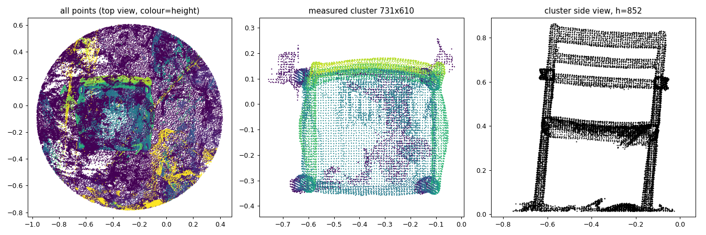

# M4: real wooden chair (iPhone 12, printed A4 ArUco board, tape-measured dimensions)

Capture: 115 photos (HEIC → JPEG, 3024×4032, EXIF kept), two handheld rings, board flat on the floor.
Board printed at 99.6% (tape: pattern 169.3 × 229.2 mm vs 170 × 230 mm) → marker edge 49.81 mm.
Scene: glossy polished floor tiles (strong reflections), leather sofas nearby.

| Step | Result |
|---|---|
| ArUco detection | markers in 100 / 115 photos, all 12 in 54 |
| COLMAP (CPU, exhaustive) | 115 / 115 images registered |
| Metric alignment | 44 corners triangulated, RMS **0.66 mm** |

## Dimensions (mm)

| | Tape | v1 (pre-registered) | **v2 (post-hoc)** |
|---|---|---|---|
| Height | 804 | 855 (+51, +6.4%) | **819 (+15, +1.9%)** |
| Width | 584 | 736 (+152, +26%) | **556 (−28, −4.7%)** |
| Depth | 496 | 643 (+147, +30%) | **542 (+46, +9.4%)** |

v2 on the simulated capture (dev set, to check the fix does not break it): height −9 mm (−1.0%),
width −12 mm (−1.6%), depth −16 mm (−2.4%) (v1 there: −27 / +5 / +0 mm).

## What went wrong in v1, and the v2 fix (made after seeing these results)

*Left: all points inside the camera ring (top view). Middle: the cluster v1 measured. Right: its side view.*

The chair itself is reconstructed well (back slats, armrests, seat, legs in the side view). Two failure modes
of a real room that the simulation did not have:

1. **Reflective floor.** 3DGS reconstructs the chair's reflection as geometry below the floor; v1's RANSAC
   floor (points within 8 cm of the board plane) was pulled ~3–5 cm down (the legs end at z ≈ 2–5 cm
   instead of 0), so height came out +51 mm. v2 keeps the ArUco board plane as the floor (RANSAC only
   within ±1 cm of it) — the board lies on the real floor and is aligned to 0.66 mm.
2. **Floor-level debris** 1.5–5 cm above the floor joined the legs and widened the footprint by ~15 cm.
   v2 drops points < 3 cm above the floor, takes the footprint between the 1st/99th percentiles along
   the min-area rectangle axes, and picks the *largest* cluster near the orbit centre (with the debris
   removed, a small blob under the seat was otherwise the *nearest* one).

## Like-for-like comparison (measurement convention resolved)

The "depth" gap (+46 mm) turned out to be a convention mismatch, confirmed with the person who measured:
the tape depth (496 mm) was taken **front-to-back across the seat**, whereas the automatic depth is the
whole footprint seen from above, which includes the reclined backrest overhanging the rear legs by ~7 cm.
Per-height bands of the v2 cluster (mm; 1st–99th percentile extents along the footprint axes):

| Band | Width | Depth | Front → back |
|---|---|---|---|
| legs 3–30 cm | 533 | 492 | −349 → +144 |
| seat 30–45 cm | 525 | **485** | −339 → +146 |
| armrests 45–70 cm | **573** | 512 | −330 → +182 |
| backrest top > 70 cm | 524 | 82 | +131 → **+214** |

| | Tape | Reconstruction (same convention) | Error |
|---|---|---|---|
| Height | 804 | 819 | +15 mm (+1.9%) |
| Width (widest = armrests) | 584 | 573 | −11 mm (−1.9%) |
| Depth (seat, front-to-back) | 496 | 485 | −11 mm (−2.2%) |

Lesson: the capture protocol must define each dimension as something a tape can actually measure
(the guide said "short side of the footprint", which nobody measures with a tape on a reclined chair).

Honesty note: v2 was designed after seeing the real-chair errors, so it has only one real test object;
the v1 numbers are the pre-registered result.

## Detailed tape protocol (second measurement session, 10 dimensions)

The dimensions were re-measured following an explicit tape protocol (docs/capture_guide.md): heights with
a book laid on the top, widths/depths outer-to-outer, overall depth and backrest overhang with the backrest
touching a wall. Note the backrest top is curved: 829 mm at the side posts, 804 mm in the middle; `height`
is the highest point (829), which is also what the reconstruction measures.

`scripts/real/measure_detail.py` measures the same definitions on the v2 cluster (1st–99th percentile
extents, nothing tuned to the tape values). Two sampling seeds:

| Dimension | Tape (mm) | Recon seed 0 | Recon seed 1 | Error (seed 0) |
|---|---|---|---|---|
| height (side posts) | 829 | 817 | 816 | −12 (−1.4%) |
| seat_height | 395 | 399 | 398 | +4 (+1.1%) |
| armrest_height | 638 | 635 | 634 | −3 (−0.4%) |
| width_armrest | 585 | 572 | 572 | −13 (−2.2%) |
| width_front_legs | 518 | 529 | 529 | +11 (+2.1%) |
| width_seat | 521 | 523 | 523 | +2 (+0.3%) |
| depth_seat | 496 | 487 | 487 | −9 (−1.7%) |
| depth_legs | 478 | 494 | 493 | +16 (+3.3%) |
| overall_depth | 563 | 548 | 547 | −15 (−2.7%) |
| backrest_overhang | 76 | 66 | 65 | −10 |

**Mean |error| 9.4 mm, median 10.4 mm, max 16 mm over 10 dimensions** (seed 1: 9.6 / 10.9 / 16.0).

Process note: the first version of `measure_detail.py` picked the depth axis from the backrest-vs-legs
median offset; the few, unevenly sampled leg points made it choose the wrong axis (absurd output such as
seat width 62 mm). It now uses the fact that the backrest is a thin plate (smallest extent along depth).
That was a bug fix; no thresholds or percentiles were changed.
